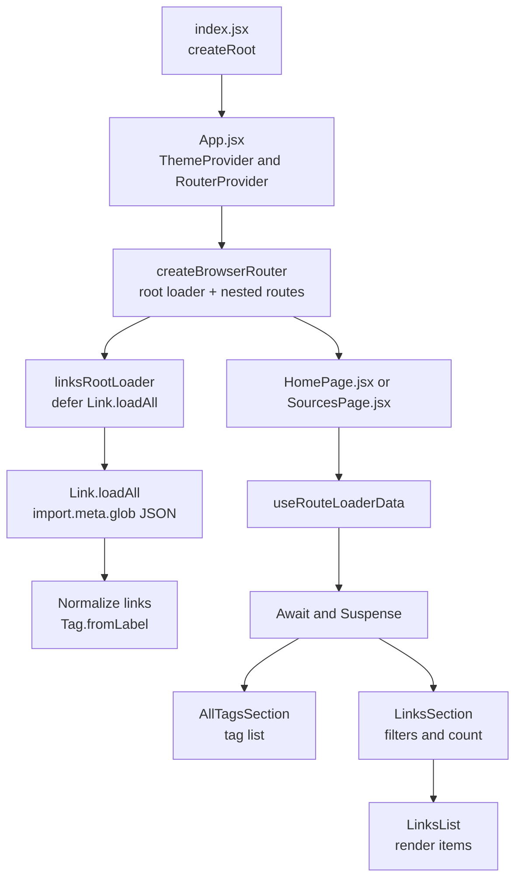

This is v3 of the Links project: feneky.com (slash) links


# File Layout

- `docs/`: product requirements (`requirements-v1.md` through `requirements-v6.md`).
- `cloud-deploy.sh`: deploys the `app/` directory to the hosting repo.
- `app/`: the deployable application (see below).

## App Directory (`app/`)

- `index.html`: HTML entry point.
- `package.json`: dependencies and scripts.
- `vite.config.js`: Vite build configuration.
- `src/index.jsx`: app entry point (mounts React).
- `src/App.jsx`: router + theme; wires the top-level routes.
- `src/components/`: UI modules (e.g., `HomePage.jsx`, `SourcesPage.jsx`, `LinksSection.jsx`).
- `src/lib/`: app helpers (`parseUrlPath`).
- `src/models/`: data models and collection helpers (`tag.js`, `tags.js`, `link.js`, `links.js`).
- `src/content/`: JSON data sources loaded at runtime.

## Content Schema

Each link entry in `src/content/*.json` uses this shape:

```json
{
  "title": "Example title",
  "url": "https://example.com",
  "published": "2024-06-28",
  "tags": ["Example", "Tag2"]
}
```

## Development

```bash
cd app
npm install
npm run dev
```

## Testing

```bash
cd app
npm test
npm run test:vitest
```

## Application Flow



# Reminder
 In reading the requirements files and this README, are there important things the in the existing architecture, what the code is doing, or how the application is arranged/displayed that need to be documented?

