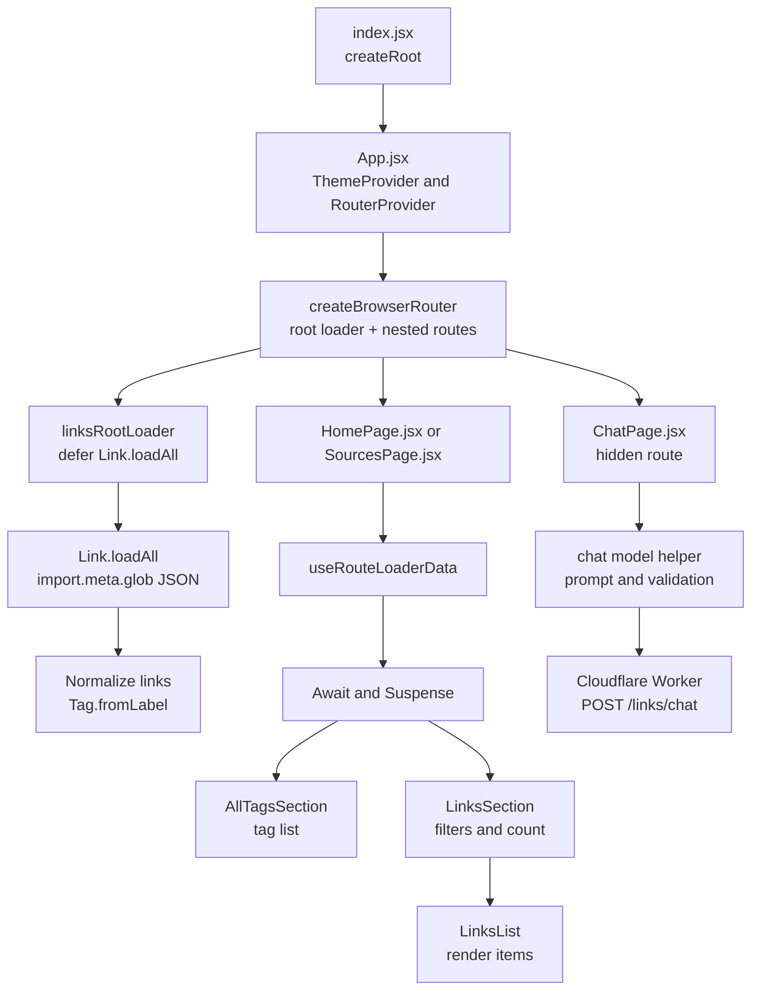

An index of great learning resources - applicable for career development in software and engineering leadership.

[](https://dl.circleci.com/status-badge/redirect/gh/johnpfeiffer/links-app/tree/main)

# File Layout

- `KERNEL/`: human only authoring of invariants and requirements
- `cloud-deploy.sh`: deploys the `app/` directory to the hosting repo.
- `app/`: the deployable application (see below).

## App Directory (`app/`)

- `index.html`: HTML entry point.
- `package.json`: dependencies and scripts.
- `vite.config.js`: Vite build configuration.
- `src/index.jsx`: app entry point (mounts React).
- `src/App.jsx`: router + theme; wires the top-level routes.
- `src/components/`: UI modules (e.g., `HomePage.jsx`, `SourcesPage.jsx`, `LinksSection.jsx`).
- `src/lib/`: app helpers (`parseUrlPath`).
- `src/models/`: data models and collection helpers (`tag.js`, `tags.js`, `link.js`, `links.js`).
- `src/content/`: JSON data sources loaded at runtime.
- Hidden chat MVP: UI route `/_chat` or `/:app/_chat`; backend API route `POST /links/chat`.

## Content Schema

This application depends on the remote resource of "favorites" on github, but as a fallback has locally cached content

Each link entry in `src/content/*.json` uses this shape:

```json
{
      "title": "Lex Fridman: Gustav Soderstrom on AI in Spotify Music",
      "url": "https://lexfridman.com/gustav-soderstrom/",
      "published": "2019-07-29",
      "tags": [
        "AI",
        "Machine Learning",
        "Podcast"
      ]
    },


{
  "title": "Example title",
  "url": "https://example.com",
  "alternate-url": "https://web.archive.org/example.com",
  "published": "2024-06-28",
  "tags": ["Example", "Tag2"]
}
```

## Development

```bash
cd app
npm install
npm run dev
```

## Testing

```bash
cd app
npm test
npm run test:vitest
```

Also see <https://blog.john-pfeiffer.com/ai-opportunities-need-improved-spec-driven-development-with-tla/>

## Application Flow



See `architecture.md` for the hidden chat system and user journey diagrams.
