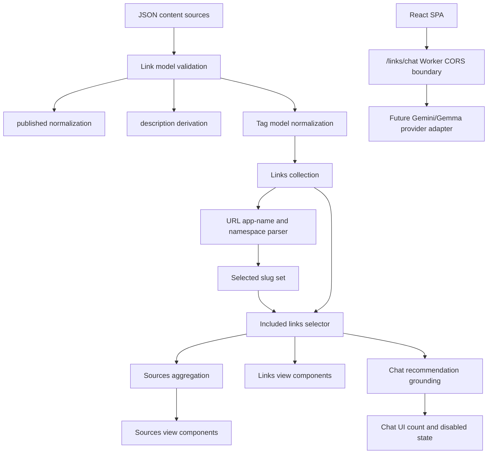
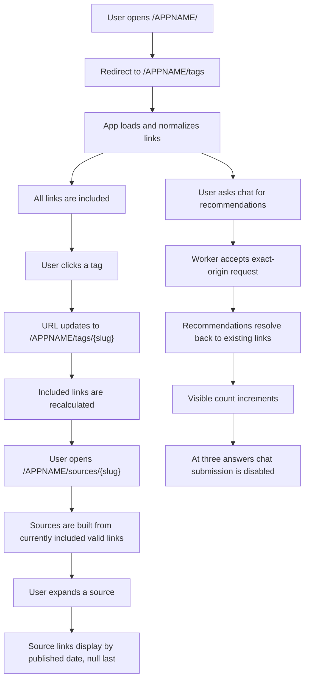

# Implementation Plan

This plan is derived from `/KERNEL/` and assumes `/KERNEL/` remains immutable.

## 1. Kernel Alignment

The current kernel is internally aligned around a loaded `Link` shape with `id`, `url`, `title`, `tags`, `published`, `description`, and `alternate-url`.

Implementation work should treat `createdAt` as non-invariant ingest/runtime metadata unless the kernel is changed to include it. It must not affect ids, selected links, source membership, source counts, or published/description behavior.

## 2. Red/Green Test Plan

Use concise table-driven tests where practical.

| Area | Red test first | Green implementation |
| --- | --- | --- |
| Link shape | loaded links expose `id`, `url`, `title`, `tags`, `published`, `description`, `alternate-url` | centralize construction/validation in `models/link` |
| Link required fields | rejects records missing non-empty `url`, `title`, or tags | normalize or skip invalid source records |
| Link ids | duplicate ids are detected or prevented | enforce unique ids in collection loading |
| Published | unknown and invalid values normalize to null | validate/normalize in the Link model |
| Published | known values preserve ISO 8601 strings | validate ISO date strings before storing |
| Description | missing or blank description derives from title | generate during Link initialization |
| Description | published year suffix is appended once | keep suffix appending idempotent |
| Alternate URL | missing alternate URL normalizes to empty string | normalize during Link initialization |
| Alternate URL | non-empty alternate URL is URL-like | validate or normalize invalid values to empty string |
| Tag normalization | case, whitespace, punctuation, and idempotence examples | centralize normalization in `models/tag` |
| Favorite tags | favorite tags including `Book` may render without backing links | represent favorites separately from loaded link tags |
| Slug uniqueness | two labels normalizing to the same slug are not both accepted silently | canonical tag collection rejects or warns |
| URL parsing | optional app name and `/tags` or `/sources` namespace are parsed distinctly | parse app name before namespace and slugs |
| URL parsing | mixed case and duplicate selected segments canonicalize to unique lowercase slugs | parse path into a slug set |
| URL generation | generated links preserve the current app name | include app base path before namespace |
| URL redirect | app base route redirects to tags namespace | redirect `/APPNAME/` to `/APPNAME/tags` |
| Filtering | no selected tags includes all links | filtering uses selected slug set |
| Filtering | selected tags include links containing every selected tag | compare selected slugs with normalized link tag labels |
| Links count | displayed count equals the unique included link count | derive count from included link collection |
| Sources | invalid URLs produce no source | guard URL parsing |
| Sources | source domain strips leading `www.` | canonicalize domain in a model/helper layer |
| Sources | membership is exact over currently included links | aggregate after filtering |
| Sources | zero-count sources are excluded | filter source groups by member count |
| Sources | links sort by published date ascending, null last | sort expanded source members by normalized published value |
| Chat recommendations | response references an unknown or duplicate link id | validate recommendations against loaded link ids before rendering |
| Chat recommendations | response includes altered link attributes | resolve recommended links from loaded link data, not generated payload data |
| Chat count | three recommendation answers already exist | disable submit and chat controls at count `3` |
| Chat navigation | Links View is visible without chat entry point | show `Ask for Recommendations` below Sources and link to `/:app/_chat` |
| Chat counter placement | recommendation count appears away from Send controls | show `Recommendations used` once near Send |
| Chat worker CORS | disallowed origin or unexpected requested header calls `/links/chat` | reject preflight/request without wildcard CORS headers |

## 3. Architecture Plan

Keep business rules in model/helper layers, not presentation components.

## 4. User Journey

## 5. Validation Gates

A task is not complete until relevant validation is run or explicitly documented as unavailable.

- Run unit/integration tests for changed app behavior.
- Run the TLA+ models when modifying specification or invariant-derived behavior.
- Confirm TLC does not report zero generated states.
- Run focused Worker CORS tests for `/links/chat` middleware changes.
- Update architecture documentation for meaningful feature/refactor work.
- Record any deleted or weakened validation criteria with the reason.
