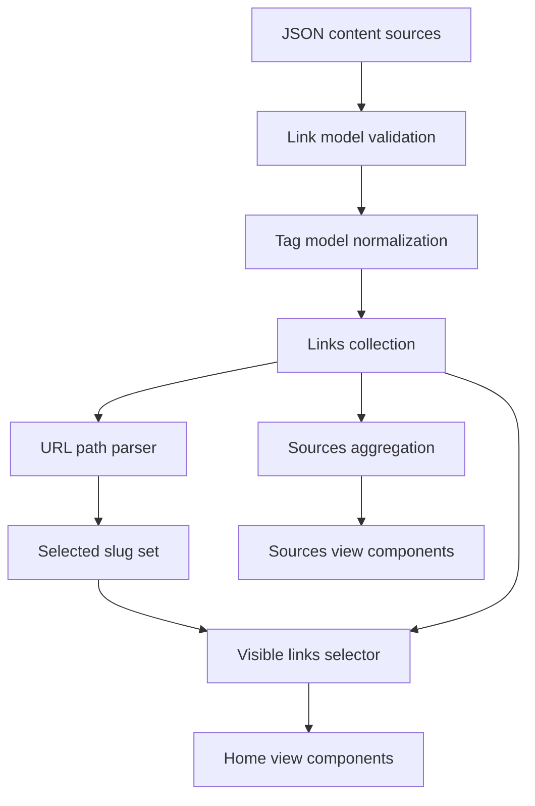
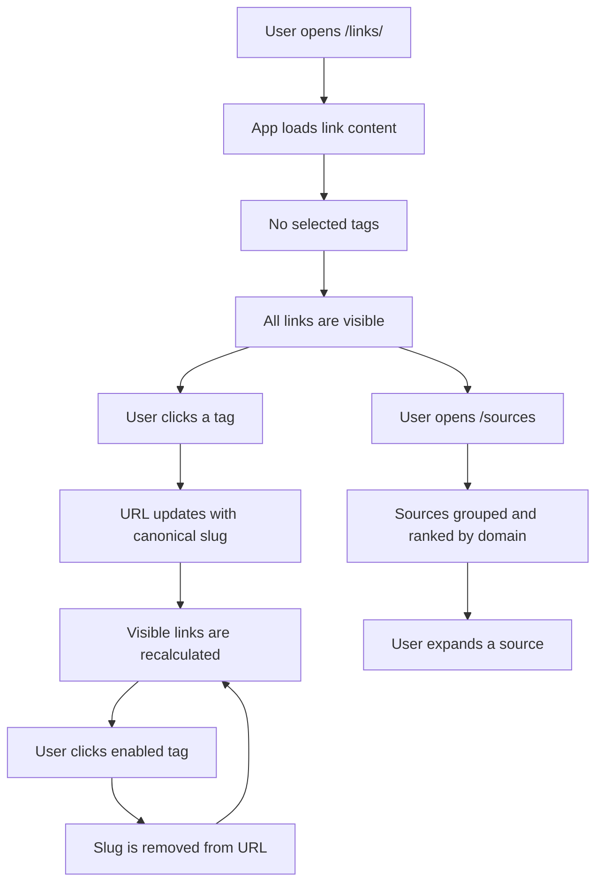

# Implementation Plan

This plan is derived from `/KERNEL/` and assumes `/KERNEL/` remains immutable.

## 1. Resolve Kernel Conflict

Status: requires human clarification before implementation that changes the invariant-governed `Link` shape.

`INV-001` defines a link record with exactly `id`, `url`, `title`, and `tags`. `requirements-v6.md` asks to add `published` to every `Link`.

Recommended human resolution options:

- Update `INV-001` to include `published` as an optional or nullable field.
- Reword `requirements-v6.md` so `published` is derived display metadata outside the invariant-governed `Link` record.

Do not implement `published` as a fifth `Link` model field while `INV-001` remains unchanged.

## 2. Red/Green Test Plan

Use concise table-driven tests where practical.

| Area | Red test first | Green implementation |
| --- | --- | --- |
| Link model | rejects records missing `id`, `url`, `title`, or non-empty `tags` | centralize construction/validation in `models/link` |
| Link ids | duplicate ids are detected or prevented | enforce unique ids in collection loading |
| Tag normalization | case, whitespace, punctuation, and idempotence examples | centralize normalization in `models/tag` |
| Slug uniqueness | two labels normalizing to the same slug are not both accepted silently | canonical tag collection rejects or warns |
| URL parsing | mixed case and duplicate segments canonicalize to unique lowercase slugs | parse path into slug set |
| Filtering | no selected tags returns all links | filtering uses selected slug set |
| Filtering | one selected tag returns links with at least one matching tag | compare selected slugs with normalized link tag labels |
| Tag toggling | disabled tag appends slug; enabled tag removes all duplicate occurrences | generate canonical target paths |
| Favorite tags | fixed tags render and behave like normal tags | render above all-tags section |
| Sources view | groups by domain, strips `www.`, sorts by count | add domain aggregation model/helper |
| Sources view | invalid URLs warn without crashing | guard URL parsing |
| Sources date ordering | dates sort ascending and null last | implement only after `published` conflict is resolved |

## 3. Architecture Plan

Keep business rules in model/helper layers, not presentation components.

## 4. User Journey

## 5. Validation Gates

A task is not complete until relevant validation is run or explicitly documented as unavailable.

- Run unit/integration tests for changed app behavior.
- Run the TLA+ models when modifying specification or invariant-derived behavior.
- Confirm TLC does not report zero generated states.
- Update architecture documentation for meaningful feature/refactor work.
- Record any deleted or weakened validation criteria with the reason.
