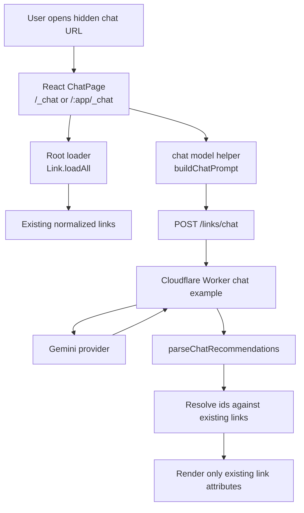
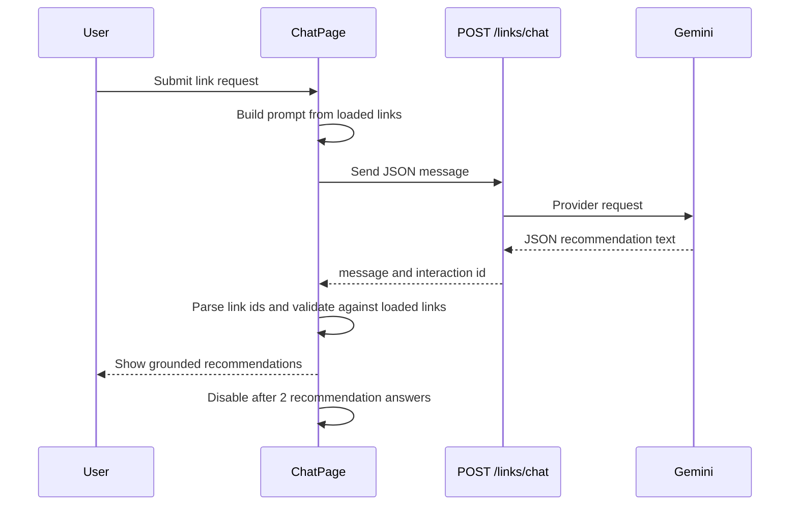

# Architecture

This document records derived implementation facts. `/KERNEL/` remains the authority.

## System Design

The hidden chat UI route is separate from `/links/chat` because `/links/chat` is the Cloudflare Worker API route in the imported backend example. The UI is reachable at `/_chat` for a root-hosted app and `/:app/_chat` for app-prefixed hosting, such as `/links/_chat`.

## Chat Journey

## Invariant Mapping

- `INV-017`: Chat renders only recommendations whose link ids resolve to currently loaded links. Unknown ids and duplicate ids inside a recommendation are dropped before display.
- `INV-018`: Chat displays `Recommendations used: N / 2` and disables new submissions after two successful recommendation answers.
- `INV-010`: Chat is an unpublished auxiliary route. Published navigation remains in the `/tags` and `/sources` namespaces.
