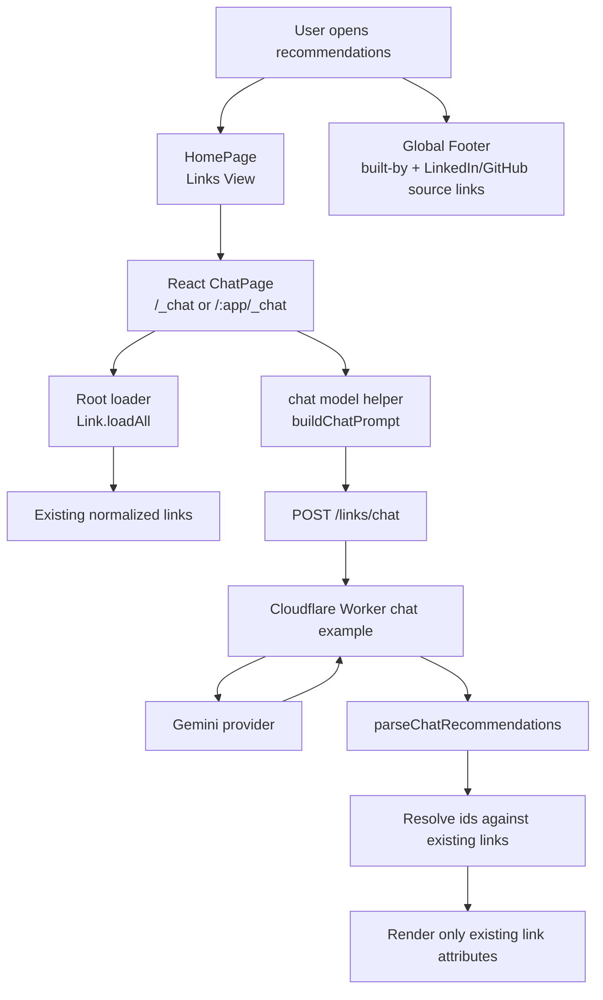
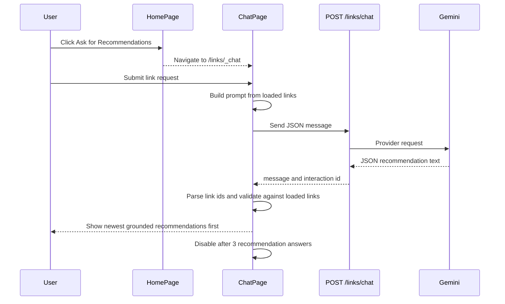

# Architecture

This document records derived implementation facts. `/KERNEL/` remains the authority.

## System Design

The visible chat UI route is separate from `/links/chat` because `/links/chat` is the Cloudflare Worker API route in the imported backend example. The UI is reachable from the Links View at `/_chat` for a root-hosted app and `/:app/_chat` for app-prefixed hosting, such as `/links/_chat`.

## Chat Journey

## Invariant Mapping

- `INV-017`: Chat renders only recommendations whose link ids resolve to currently loaded links. Unknown ids and duplicate ids inside a recommendation are dropped before display.
- `INV-018`: Chat displays `Recommendations used: N / 3` near the Send button and disables new submissions after three successful recommendation answers.
- Requirements v7: The Links View exposes `Ask for Recommendations` below Sources navigation and routes users to `/:app/_chat`.
- Chat UI behavior: New recommendation answers are prepended above older answers so the newest response stays nearest the request controls.

## Global Footer

`app/src/components/Footer.jsx` is a pure presentational component rendered once in `App.jsx` (inside the `ThemeProvider`, after the `RouterProvider`) so it appears on every route. It shows a "Built by John Pfeiffer" line with LinkedIn and GitHub source-link icons (`@mui/icons-material`); the GitHub link points at this repository. Covered by `Footer.test.jsx` (jsdom, `createRoot` + `act`).
